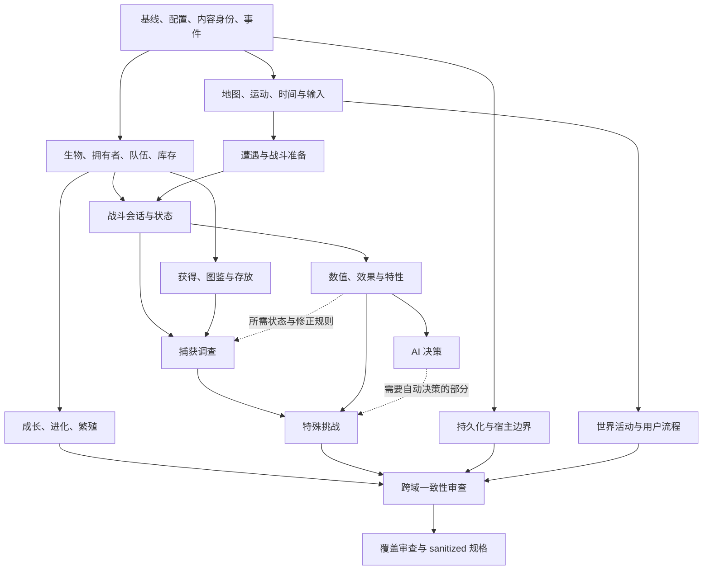

# 高层领域地图

基线、路径缩写及 E 证据编号见 [repository-overview](../analysis/repository-overview.md)。这是基于入口、调用、配置和内容样本整理的 **18 个概念领域**，不是参考目录重排，也不规定未来实现边界。

2026-09-19 修订已核对本地基线与 review 均为提交 `8c5911e4a4b07b07e832e4bb0d5d8859e88b4a9b`。本图仍是调查导航，不能直接作为独立实现的最终开发规格。

“Pokémon-specific?”：**混合**表示存在可泛化概念和 Pokémon 特定规则；“RMXP/RGSS-coupled?” 描述当前行为的宿主交互，**部分**不意味着实现已解耦。建议规格组沿用根目录七类分类；矩阵用 `Combat` 表示 `Combat Requirements`，用 `Engine/Overworld` 表示引擎/世界集成。

| ID / Major Domain | Responsibility | Important Subdomains | Important Dependencies | Pokémon-specific? | RMXP/RGSS-coupled? | Suggested future specification group | Evidence |
| --- | --- | --- | --- | --- | --- | --- | --- |
| D01 通用运行能力与扩展 | 提供配置、内容身份查找、通知与扩展、随机/时钟依赖和故障反馈 | 参数集、命名注册、事件/菜单扩展、插件依赖、时间/随机、诊断、文件/HTTP | 宿主时间、文件、输入；为所有领域服务 | 混合，设置含 Pokémon 策略 | 部分，时间、文件和日志出口受宿主影响 | Generic Kernel；集成边界另列 Engine/Overworld | E01–E04、E08、E11（含 HTTP 直接入口） |
| D02 内容数据与本地化 | 将作者内容转成可引用的数据，支持诊断与文本语言变体 | PBS schema/引用、编译/反写、备选数据集、资源命名、核心/游戏/地图文本 | D01；具体领域提供字段语义；D18 编辑入口 | 混合，绝大部分内容是 Pokémon 数据 | 部分，编译也触及地图事件和宿主资源 | Generic Kernel + Pokémon Rules + Demo/Developer Experience | E04–E06、E34 |
| D03 游戏生命周期与持久化 | 新游戏、继续、保存、版本转换、异常恢复和累计记录 | 启动值/游戏状态、保存失败、旧版本转换、地图恢复、游戏统计 | D01、D02；持久状态来自 D04、D06–D17 | 混合，保存机制通用，状态具体 | 强，现有存档包含地图与宿主状态 | Generic Kernel + Engine/Overworld | E07、E08 |
| D04 地图、运动与事件世界 | 定义玩家所在世界、移动限制与事件交互 | 地图连接/转移、地形碰撞、走跑骑乘、事件页/命令、NPC/跟随、随机地牢 | D01、D02、D03、D05；D14 提供场地许可/效果 | 混合，基础世界通用 | 强 | Engine/Overworld；地牢玩法保留在此，补充“可选通用玩法”标签 | E09、E10、E29 |
| D05 资源、呈现与输入 | 表达世界和交互反馈，并接收用户操作 | 资源解析、声音、tileset/地图绘制、精灵/过渡、文本窗口、按键/文字输入 | D01、D02、D04；被 UI、战斗和小游戏消费 | 大部分否，资源选择含物种/形态约定 | 强 | Engine/Overworld + UI；资源身份归 Generic Kernel | E11、E12、E31 |
| D06 生物个体与 Pokémon 基础规则 | 定义生物是什么、具有何种持久属性和可变状态 | 物种/形态、身份来源、属性/性别/异色、IV/EV/Nature、HP/状态、招式；Mega/原始回归状态；Shadow/净化 | D01、D02；D07 所有者；D09 成长；D11 变身/呼唤上下文；D12 战斗消费者 | 混合；属性概念与 Pokémon 具体判定分开 | 部分，创建与形态会读取位置/时间/展示信息 | Creature RPG + Pokémon Rules | E04、E12、E21、E25 |
| D07 玩家、训练家与生物集合 | 表达拥有者、能力许可、队伍及长期存放 | 玩家身份/货币/徽章、NPC 队伍、伙伴、出战资格、盒子、赠送/交换边界 | D03、D06；D08 库存；D15 图鉴；D16 选择与操作 | 混合 | 部分，伙伴和许可接入事件世界 | Creature RPG + Pokémon Rules + UI | E13、E18、E31 |
| D08 库存、道具与交易 | 保管与使用资源，处理消耗、资格、买卖和持有效果边界 | 背包口袋、物品储存、注册快捷使用、治疗/培养道具、球的库存/消耗、持有物、商店/积分兑换 | D02、D06、D07；D10 捕获专用条件；D11/D12 战斗上下文；D16 交互 | 混合，道具种类与效果多为 Pokémon 特定规则 | 部分，野外道具、菜单与事件商店耦合 | Creature RPG + Pokémon Rules；Combat 与 UI 边界分别提取 | E14、E15、E20 |
| D09 成长、进化与繁殖 | 描述生物长期变化、招式学习/替换和后代生成 | 经验/等级、学习/替换、友好与亲密、进化触发、寄养、遗传、蛋/孵化；Shadow 成长约束引用 | D06、D07、D08；D01 时间/随机；D04 步数；D11 提供战斗中及结束时的成长上下文，成长结果可反馈当前战斗；D16 交互 | 混合，生命周期可泛化，实际条件与遗传为 Pokémon 特定规则 | 部分，步数/场所/场景和事件收费参与 | Creature RPG + Pokémon Rules + UI | E12、E16、E17、E21、E25 |
| D10 遭遇、捕获与获得入口 | 从世界情境产生对手；定义捕获判定并协调获得结果 | 遭遇表/抑制/修改、漫游、雷达、赠送入口；球捕获、抢夺例外、捕获特有入队策略 | D04、D14 环境；D06 个体/Shadow；D07 容量；D08 球/道具；D11 战斗与成长时序；D15 图鉴 | 混合，遭遇/获得通用，球和雷达等为 Pokémon 特定规则 | 部分到强，触发在世界、结果跨多个系统 | Creature RPG + Pokémon Rules + Combat + Engine/Overworld | E18–E20、E13、E25 |
| D11 战斗会话与回合流程 | 约束参战、动作、推进及与 RPG 系统的交界 | 野生/训练家/伙伴与控制归属；单/双/三打及双方场上生物数量不对称；参与/会话边界；回合/行动/状态推进；切换/逃跑/位置移动/呼唤/服从性；Mega/原始回归时机；成长反馈/终局 | D06–D10、D12；D09 成长/学习结果更新当前战斗；D05/D16 呈现；D01 随机 | 混合，流程通用，服从性等为 Pokémon 特定规则 | 部分，准备、战斗中与结算均跨世界/UI/个体状态 | Combat Requirements；Pokémon Rules 单独注明 | E16、E18、E21–E23、E25 |
| D12 战斗效果规则与决策 | 确定效果结果和自动控制方的选择策略 | 属性/命中/伤害、状态与能力阶级、天气/场地、招式效果族、特性/道具触发、变身后的数值/特性联动、AI 技能及评分 | D06、D08、D11；D02 内容与 D01 变体/随机；捕获判定引用 D10，服从性引用 D11 | 是，AI 的决策概念可泛化 | 部分，主要规则依赖战斗状态，也触发表现 | Pokémon Rules + Combat Requirements | E22–E25、E21 |
| D13 特殊战斗与设施挑战 | 在基础战斗上提供会话限制、参赛约束和比赛变体 | 狩猎区、捕虫大会、杯赛规则、Tower/Palace/Arena、Factory 租借、记录/回放 | D03、D07–D12；D04 时间/地图；D16 参赛选择 | 大部分是 | 部分到强，接待/判奖事件与场景参与 | Combat + Pokémon Rules + Creature RPG；集成另列 | E26、E27、E34 |
| D14 世界活动与场地规则 | 让时间、步数、环境和玩家能力产生持续效果 | 昼夜/天气、场地招式、钓鱼、树果、毒/友好/病毒/治疗点与失败回程 | D01、D04、D06–D10；D05 表现；D03 保存 | 混合 | 强，行为依赖地图、事件、角色与场景 | Engine/Overworld + Pokémon Rules + Creature RPG | E18、E19、E28 |
| D15 图鉴、联络与外部奖励 | 记录收集成果并提供地图、联络、邮件和礼物流程 | 图鉴/区域解锁、Pokégear/地图/音乐、电话再战、邮件、神秘礼物 | D02、D03、D06–D10；D01 HTTP；D16 界面 | 大部分是，部分记录/通讯概念可泛化 | 部分，地点/公共事件/音频和保存参与 | Pokémon Rules + Creature RPG + UI | E15、E30 |
| D16 玩家操作流程与 UI | 呈现领域允许的操作，定义看见、选择、确认、取消反馈与返回 | 标题/载入/选项、暂停/PC、队伍/摘要/盒子、背包/购物、战斗/学招/替换选择、进化孵化交换/净化/名人堂 | D03、D05 及相应领域；D01 菜单可用条件；取消许可与强制入队等策略由领域提供 | 混合 | 强 | UI；领域状态变更与许可仍归相应行为规格 | E31、E15–E17、E20、E25 |
| D17 小游戏与可选活动 | 提供独立活动的开始、行动、结束和收益 | Duel、Triple Triad、Slot Machine、Voltorb Flip、Lottery、Mining、Tile Puzzles | D01、D05、D07、D08；部分用物种/所有者数据 | 混合 | 强，交互、事件入口与奖励参与 | 按七类记录有关行为；可复用玩法补充“可选通用玩法”标签，胜负规则不自动归入 Kernel 或 UI | E32 |
| D18 开发者工作流与 demo 证据 | 支持作者制作、诊断、转换、生成内容，并验证示例如何组合能力 | 调试菜单、内容编辑器、动画/资源工具、事件转换、设施生成、demo 覆盖与材料缺口 | D01–D17 的数据与行为；现有编辑/运行工具 | 混合 | 强，许多工具写入 RMXP 工程材料 | Demo/Developer Experience；兼容要求另列 | E05、E27、E33、E34 |

## 分类与责任边界

- **Generic Kernel**：配置、身份/注册、通知与扩展、随机/时间需求、持久化、内容诊断、本地化、资源/文件访问。只抽取被观察到的能力，不预设服务/API。
- **Creature RPG**：生物身份、拥有者、队伍、盒子、库存、获得、成长和生命周期。当前默认数值不应自动提升为所有 Creature RPG 的规则。
- **Pokémon Rules**：类型、IV/EV/Nature、性别/异色的具体判定、图鉴、进化条件、遗传、球、特性、招式及专用模式。属性概念和 Pokémon 具体规则分开，不因出现于参考项目就自动归入此类或通用层。
- **Combat**：战斗必须接受的上下文、合法动作、顺序、状态变化、结果和决策约束；不规定战斗实现方式。
- **Engine/Overworld**：地图/地形、事件、移动、资源呈现、输入、场景、声音和世界保存的接合行为。
- **UI**：交互入口、可见性、选择与取消、反馈及返回点。没有完整资源时只建立静态流程证据。
- **Demo/Developer Experience**：制作与调试工作流、内容转换、示例配置和实际演示待证项。demo 内容不能自动成为框架硬规则。

**可泛化不等于 Generic Kernel。** 地牢布局和棋盘胜负等仍是具体玩法；保留在 D04/D17，可附“可选通用玩法”标签。该标签不新增第八个 Classification，也不决定未来代码归属。其随机等基础设施需求可引用 D01，不能因此把整个玩法归入内核。本文“Pokémon 特定规则”仅作领域分类，不作法律属性判断。

**每条规则只有一个主规格。** 跨领域用规则编号引用，不再定义公式或判定；跨域流程单独记录顺序、前置和共享不变量。主规格是文档归属，不要求由一个类、服务或战斗后端实现。

| 捕获流程中的内容 | 唯一主规格归属 | 其他领域怎样引用 |
| --- | --- | --- |
| 捕获概率、判定过程、特殊球修正与抢夺例外 | D10／F10-06／WP38 | D06/D12 提供所需个体/战斗状态，D08 提供物品信息；不另写捕获公式 |
| 球库存、通用道具资格、扣除与失败消耗 | D08／F08-01、F08-03／WP27、WP28 | 战斗/捕获专用条件引用 D11/D10，不因检查写在道具文件就另定义一份 |
| 目标/战斗资格、投球时机、行动占用、是否继续战斗 | D11／F11-03、F11-07／WP40、WP42 | 引用 D10 的捕获例外与 D13 的模式差异 |
| 捕获特有的强制入队、可否改送盒子或取消接收策略 | D10／F10-06／WP38 | D11 提供会话设置；D07 执行合法集合变更；D16 只呈现允许的选项 |
| 获得后的所有权、容量、队伍替换和存放 | D07／F07-01、F07-04、F07-05／WP18、WP25 | 捕获、赠送、交换共用集合规则，保留各入口特有流程 |
| 见过/拥有/形态等图鉴登记规则 | D15／F15-01／WP62 | 获得流程传入登记事实，跨域流程另记登记时机 |
| 命名、选择替换、取消反馈与返回路径 | D16／F16-03、F16-05／WP66、WP67-A | 交互不得自行放宽领域许可；尤其不能把强制入队当作纯菜单限制 |

捕获流程还需追踪经验处理、形态恢复、登记与存放顺序，不能概括为成功后直接加入队伍。成长/学习规则由 D09 定义；D11 记录战斗中及结束时的触发、交互等待和当前参战状态更新。进化条件归 D09，所需属性归 D06；地牢玩法归 D04，绘制归 D05。

## 默认行为与配置变体

每项行为都记录：**基线默认行为、支持但未默认启用的变体、配置/数据/插件之间的关联、尚未验证的组合**。D01 维护全局索引，具体语义由相应领域负责，不能只分析默认路径。

例如亲密效果、捕获经验、战后进化检查范围及濒死资格、Mega 后行动顺序重算均有设置证据（E02），相关消费者见 E16、E18、E21。设置声明、分支存在和组合可运行分别取证，不将一者代替另一者。

参考快照的实际行为、官方某版本的预期行为、新框架将来选择的目标行为应分别标记。当前只提取前者；官方一致性需要另行证据，未来取舍留给后续独立阶段。

## 复杂子功能的跨域追踪

以下复用现有功能/任务编号，不新增领域。表中分工遵循单一主规格；同一个子功能可以引用多条不同规则。

| 子功能 | 主规格与跨域交界 | 功能／任务追踪 | 证据 |
| --- | --- | --- | --- |
| Mega／原始回归 | D06 定义各自个体变身条件、形态变化与还原；D11 定义战斗情境的资格/触发及 Mega 使用次数/顺序；D12 定义变化后的数值/特性效果，不能假设两种变身规则相同 | F06-08、F11-03、F11-04、F12-06；WP22、WP40、WP48、WP49 | E02、E21、E25 |
| Shadow 完整流程 | D06 定义心灵/Hyper 状态、成长限制/暂存和净化恢复；引用 D09 的成长/学习规则；抢夺例外归 D10，呼唤执行归 D11，交互归 D16 | F06-08、F09-01、F10-06、F11-03、F16-06；WP23、WP30、WP38、WP40、WP67-B | E16、E20、E21、E25 |
| 招式学习与替换 | D09 定义学习/替换判定，D06 定义招式/PP 状态，D11 定义战斗内触发与当前状态更新，D16 定义选择/放弃反馈 | F06-06、F09-01、F11-07、F16-03、F16-05；WP20、WP30、WP42、WP66-A、WP67-A | E12、E16、E21、E31 |
| 战斗位置移动 | D11 定义位置移动资格、行动及与替补换人的差别；D12 提供受位置影响的目标/效果规则 | F11-03、F11-05、F12-03；WP40、WP41、WP45 | E21、E22 |
| 呼唤 | D11 定义动作与执行时机；Shadow 状态变化引用 D06，其他状态/能力阶级结果引用 D12；不能只当成 Shadow 标签或 AI 策略 | F11-03、F06-08、F12-02；WP40、WP23、WP44 | E21、E25 |
| 服从性 | D11 定义命令能否按意图执行及不服从结果，引用 D06/D07 的个体/拥有者/等级/徽章和 Shadow 条件；与 D12 的 AI 选择策略分开 | F11-03、F07-01、F07-03、F06-08；WP40，WP51 仅引用 | E02、E22、E25 |

D11 的详细调查按“参与与会话边界”“回合、行动和状态推进”“战斗与 RPG 系统交界”三个子范围组织。尤其需查明成长触发、学招交互以及变化后的能力/招式何时供仍在继续的战斗使用；本图不预分配任何行为给未来特定后端。

## 依赖驱动的阅读路线

图中箭头代表**调查知识依赖**，不是运行时单向架构，也不是要求整域完成才能启动下一域的调度表。区分“开始调查所需输入”与“完成规格前必须闭合的引用”：捕获可以先调查基本判定/获得流程，再补所需特殊规则，无须等待全部战斗效果或 AI 完成。

UI、demo 证据和局部一致性核对随领域推进：在生物—队伍—储存、战斗中成长—学习反馈、捕获—战斗—图鉴三个交界设检查点；未就绪引用保留待核项，最终仍执行 WP78 的全局审查。启动/完成依赖与检查点见 [extraction-plan](extraction-plan.md)。

覆盖追踪链为 **Dxx 领域 → Fxx 功能 → 行为规格/规则编号 → 证据与测试场景**。E 编号只定位证据包；“已定位、静态确认、数据样本确认、运行确认、待验证”按具体结论记录，定义与当前证据状态见总览。18 行领域都有内容，不代表 113 个功能组或其全部行为已经提取完成；当前没有运行确认。
