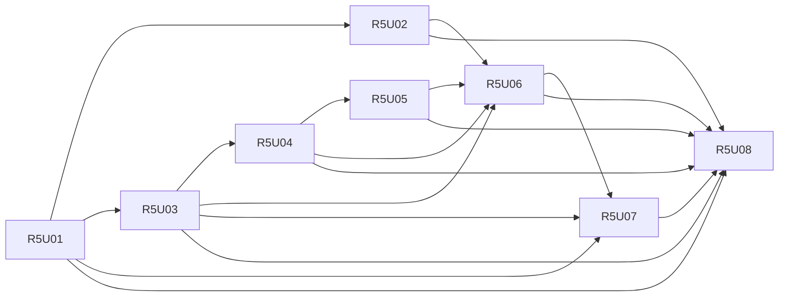

# 第五轮依赖与文件冲突

依赖控制实际贡献接受，候选目录互不相交。

```mermaid
graph LR
  R5U01 --> R5U02
  R5U01 --> R5U03
  R5U03 --> R5U04
  R5U04 --> R5U05
  R5U02 --> R5U06
  R5U03 --> R5U06
  R5U04 --> R5U06
  R5U05 --> R5U06
  R5U01 --> R5U07
  R5U03 --> R5U07
  R5U06 --> R5U07
  R5U01 --> R5U08
  R5U02 --> R5U08
  R5U03 --> R5U08
  R5U04 --> R5U08
  R5U05 --> R5U08
  R5U06 --> R5U08
  R5U07 --> R5U08
```

21个共享文件冲突超边及所有85个唯一写者见 [file-conflict-graph.json](file-conflict-graph.json)。候选可以并行，正式整合不能多写。
